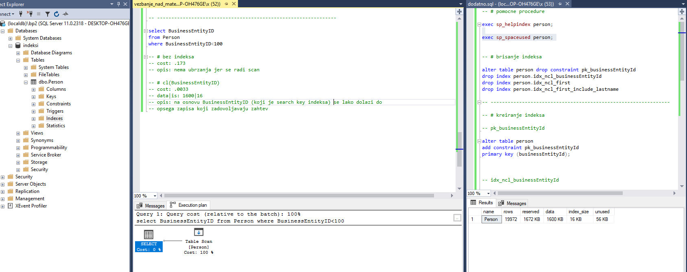

Skripta `vezbanje_nad_materijalom_nakon_prolaska.sql` sadrzi 
objasnjenja razlicitih opcija koje postoje za upite iz materijala.

S obzirom da neki koncepti nisu korisceni na ranijim upitima zbog
toga sto nisu jos obradjeni nismo mogli da ih koristimo. U ovoj
skripti su razmatrana sve mogucnosti. Moze biti korisna nakon sto
se materijal potpuno prodje.

Skripta `dodatno.sql` sadrzi sva potrebna ogranicenja i druge naredbe
koje mogu da se koriste radi efikasnijeg rada. Preporucujem da se
otvori u drugom panelu prevlacenjem tab-a u kome je otvorena na neku
od strana (levo/desno). Na sledecoj slici se moze videti kako to izgleda:

Ovako u paralelnom prikazu mozemo brze da kreiramo i brisemo kljuceve, a i
da izvrsavamo procedure `sp_helpindex` i `sp_spaceused`
