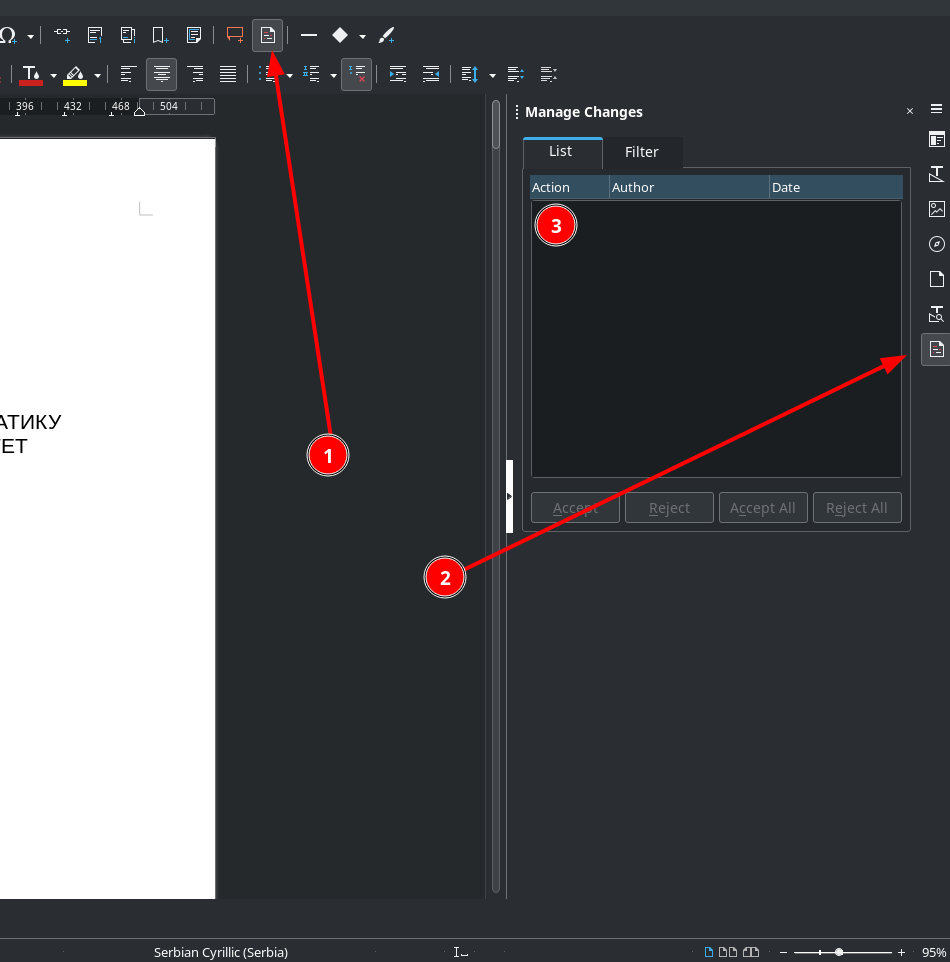

# Vodič
U ovom fajlu se nalaze linkovi ka resursima koji su vezani za ovaj predmet

## Informacije i napomene

### Prezentacija

Trebala bi da traje oko 15-20 minuta. Nakon toga slede pitanja.

Prezentacija treba sadržati:
1. motivaciju rada
2. tehničke detalje
3. arhitekturu sistema
4. rezultate

Stavke 1. i 4. su veoma bitne jer one predstavljaju suštinu rada.

Poželjno je da se dođe ranije kako bi se prenela prezentacija na računar i kako bi se proverio projektor.

Ne bi bilo loše da se osim prezentacije ponese i sam rad, za slučaj da je potrebno nešto prikazati nešto što nije
bilo prikazano prezentacijom (naravno, ovo nije poželjno jer se očekuje da će se sve bitno naći na prezentaciji, ali
ukoliko se desi da se ne nađe i da treba, može da bude korisno).

### Tvrdo koričen dokumenta (tvrda kopija)
  * Izrada može da potraje. Teško se može pronaći neko ko to može izraditi u toku dana, tako da to treba imati u vidu
  * Koričenje košta oko 700 dinara, a štampanje jedne strane u boji 30 dinara. Radovi obično imaju oko 40 strana, što iznosi oko 1900 dinara
  * Neke štamparije / knjigoveznice mogu da izrade dokument za jedan dan
  * U blizini fakulteta to mogu da odrade: fotokopirnica Duga i [knjigoveznica koja se na nalazi iza fakulteta](mailto:stevansedl@gmail.com)
  * Neki studenti izrađuju i dodatnu kopiju za sebe

## Koristan materijal

### Šabloni
[Šablon (ods)][ods] - u ovom fajlu se definisane promenljive (tekst sive boje predstavlja promenljivu) kojima mogu da se dodele vrednosti.
U LibreOffice-u mogu da se set-uju: 
1. Klikom na neku od njih i unosom vrednosti u polje `Value`
2. `Insert > Field > More Fields > Variables`. 
Naravno, moguće je i ne koristiti promenljive. U tom slučaju mogu samo da se obrišu i zamene nekim drugim sadržajem.

Mentor može uključiti praćenje izmena: `Edit > Track Changes > Record`. Te izmene (3) se mogu videti klikom na `Show Track Changes Functions` (1) ili
u sidebar-u klikom na `Manage Changes` (2).

### Linkovi ka korisnim resursima

#### LibreOffice

[Podešavanje numerisanja naslova](https://ask.libreoffice.org/t/how-do-you-do-header-style-numbering/45655/2)  
[Uklanjanje rednog broja na određenim naslovima](https://ask.libreoffice.org/t/how-do-you-do-header-style-numbering/45655/2)  
[Polja (fields) u LibreOffice-u](https://help.libreoffice.org/latest/lo/text/swriter/01/04090005.html)  
[Brisanje metapodataka](https://superuser.com/questions/1195338/what-metadata-does-a-libreoffice-file-contain-and-how-to-remove-it#1195750)  

## Ostalo
Ova sekcija sadrži materijal koji nije obuhvaćen prethodnim sekcijama.

[O predmetu (PDF)][o predmetu]  
[Sve o predmetu - IMI sajt][o predmetu - imi]

# Napomena
Ukoliko primetite neku grešku, uradite jednu od slećih stvari:
* [napravite "issue"][new issue] sa opisom problema
* kontaktirajte nekog od administratora: Srđan Todorović, Dragor Draganović, Mihajlo Janković  
* ukoliko želite da dodate ili izmenite nešto, [pošaljite "pull request"][pull request]

[//]: # (---------------------------------------------------------)

[//]: # (-------------U ovom delu se nalaze reference-------------)

[//]: # (---------------------------------------------------------)

[ods]: ./шаблон-завршни_рад.odt

[ostalo]: ./Ostalo

[o predmetu]: https://imi.pmf.kg.ac.rs/knjiga_predmeta/inf_os/zavrsni_rad.pdf
[o predmetu - imi]: https://imi.pmf.kg.ac.rs/index.php?id=783

[new issue]: https://github.com/studnetwork/PMFKG/issues/new
[pull request]: https://github.com/studnetwork/PMFKG/compare

