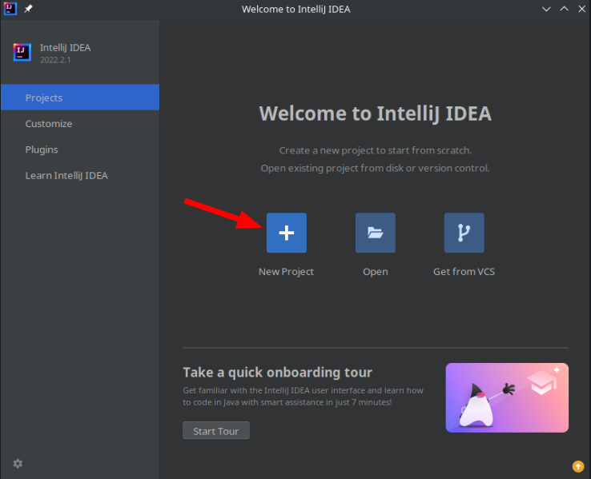
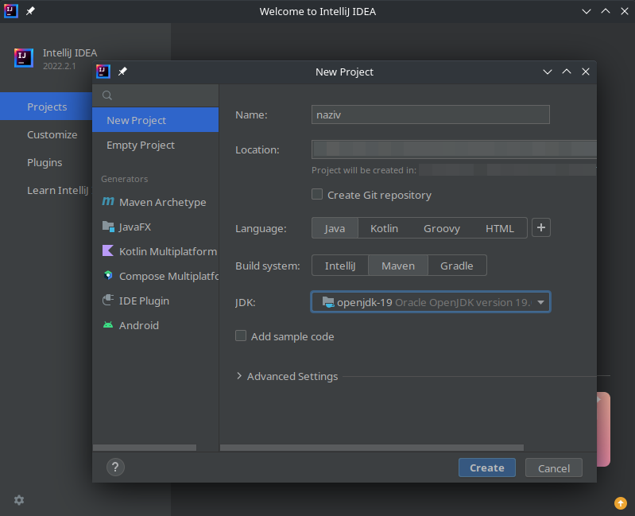
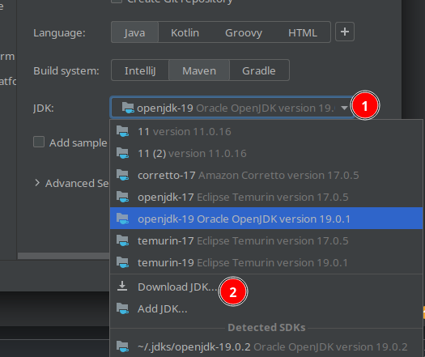
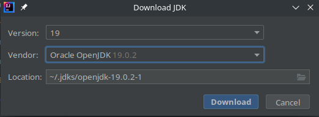
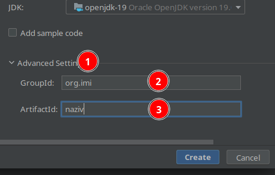
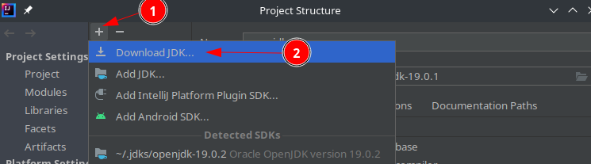
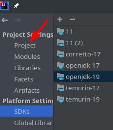
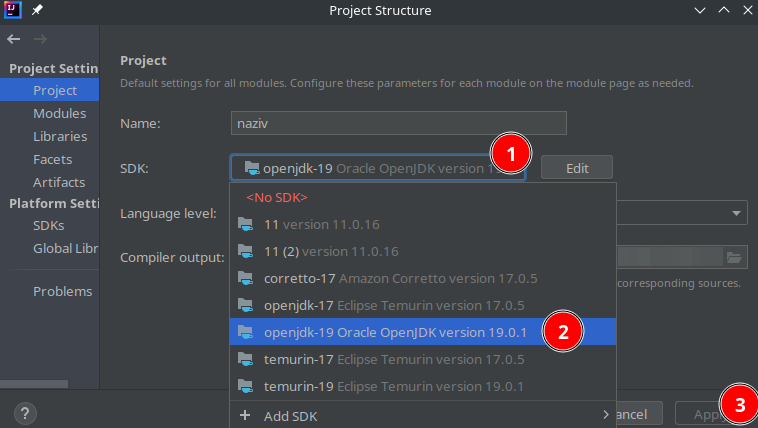

**Napomena**: nakon pritiska `Download` u `Download JDK` prozoru potrebno je da se saceka da se JDK preuzme i da se svi fajlovi indeksiraju

# Kreiranje maven projekta

# Podesavanje verzije jave u otvorenom projektu

Ako je vec preuzeta ispravna verzija onda se mogu preskociti tacke `2.` i `3.`

Koraci
1. `Ctrl` + `Alt` + `Shift` + `S` ili `File > Project Structure...`
2.  
3.  
4.  
5.  