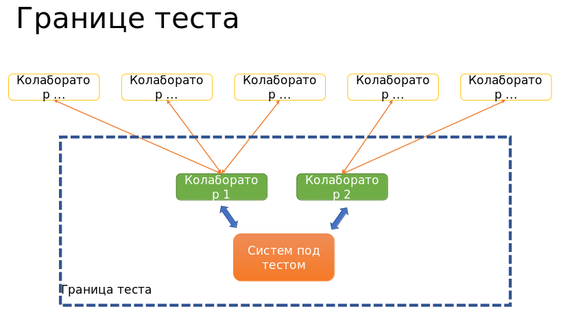
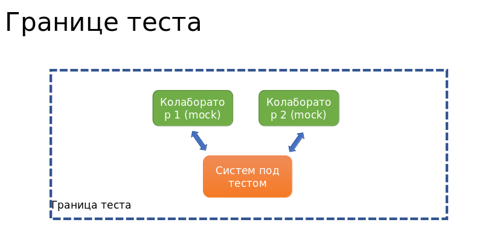

# Parametarizovani testovi

Kada pisemo testove hocemo da pokrijemo sto vise
razlicitih slucajeva (npr. ulaznih vrednosti, stanja, ...). Pisanje testova koji se razlikuju
samo po ulaznim parametrima nije preporucljivo
jer se tesko odrzavaju, veci je kod pa moze 
lako doci do greske (npr. ne azuriramo isti kod u 
svim testovima pa dodje do greske u nekom trenutku 
u onom testu koji nije azuriran).

Kako bi se izbeglo ponavljanje i svi problemi koje
ono nosi umesto zasebnih testova pisemo jedan
parametarski test. 

Parametarski test sadrzi zajednicki kod i uredjenu
listu parametara i vrsi proveru za svaku torku, 
koristeci isti kod.


Sintaksa:
```
@RunWith(Parameterized.class)
public class KlasaKojaSeTestiraTest {
    
    private Param1 param1; 
    private Param2 param2; 

    public (Param1 param1, Param2 param2) {  
        this.param1 = param1;
        this.param2 = param2;
    }

    @parameterized.Parameters 
    public static Collection listaTorki() {
        return Array.asList(new Object[][] {
            { new Param1(1), new Param2(1) },
            { new Param1(2), new Param2(2) },
            { new Param1(3), new Param2(3) },
            { new Param1(4), new Param2(4) },
        });
    }

}

@Before
public void setup() {...}

@Test
public void nekiTest() {...}

...

``` 

**Napomena**: svaki parametar torki koje vraca `listaTorki`
              mora da bude prisutan u konstruktoru
              (jer se vracena kolekcija koristi za 
              popunjavanje tih vrednosti u konstruktoru)


# Custom runner


# Mocking

U OOP klasa predstavlja unit.

Cilj unit testing-a:
* izolacija dela koda (proveravamo rad samo tog dela)
* verifikacija ispravnosti koda
* pronalazak nekih bug-ova
  (unit testovi se rade najcesce od strane developer-a, pa
   ukoliko ih oni rade onda ce se neke greske naci u ranijim
   fazama razvoja, tj. na samom pocetku, a sto moze smanjiti
   troskove koji bi u kasnijim fazama bili veci)


Unit testing je prva faza testiranja, nakon koje idu
integration testing, system testing i na kraju acceptance
testing.


Kod njega se svaka celina (unit) testira zasebno.

U OOP klase cesto koriste polja i metode neke druge klase.

Unit testing podrazumeva testiranje samo jedne klase, ali
klasa moze da ima neke zavisnosti, da koristi neku drug 
klasu. Ta druga klasa moze da sadrzi neke greske sto 
komplikuje situaciju jer zbog toga ne mozemo da znamo da
li postoji greska u klasi koju testiramo ili u toj drugoj
klasi koju nasa (klasa pod testom) koristi.

Kako bi se klasa koja se testira izolovala od njenih 
zavisnosti koristimo **mock objetke tih zavisnosti**.

To su objekti koji ce lazno predstavljati objekte tih 
zavisnosti. Za izabrane situacije mozemo da definisemo
sta ce se dogoditi (npr. da se vrati odredjena vrednost ili
da se baci neki exception).

Ovime se uklanja mogucnost nastanka greske od nekog spoljnog
uticaja i time izolujemo samo klasu koju testiramo. Ako
dodje do greske bicemo sigurni da se problem nalazi u samoj
toj klasi, a ne u drugoj.




Neki od problema koji mogu da se dese u drugoj klasi su:
* problem u kodu (bug)
* problem u toj klasi uzrokovan problemom u nekoj trecoj klasi
* problem sa nekim resursom (nedovoljno prostora, losa
  internet veza)

Kao sto se moze videti iz navedenih primera, kod druge
klase moze i da bude ispravan, a da pritom opet dodje do
otkaza i time do pada testa.


Mock-uju se zavisnosti, druge klase. 

Mozemo doci i u situaciju u kojoj imamo 2 metoda klase koju
testiramo. Jedan od njih ima bug, a drugi koristi taj metod.
Prvi metod se ne mock-uje. Iako izgleda da je potrebno
izolovati metode jer ne mozemo proveriti ispravno jedan
ukoliko drugi ne radi, mock-ovanje ne radimo.

Moguce razlog za ovu praksu je to sto je to sto se obicno
uzima klasa kao jedan unit pa u tom slucaju sve unutar te
klase je unutar unit-a, a sve izvan okruzenje od kojeg
izolujemo nas unit. Tada, ono sto je unutar unit-a 
ne mock-ujemo jer nije potrebna izolacija, a ono
sto je izvan unita mock-ujemo.

Mockovanje koda unutar klase bi samo dodatno oduzelo vreme
i uvelo novu kompleksnost iako to moze da se verifikuje
proverom i ispravkom same implementacije. 

Direktno koriscenje nekog polja/metoda iz metoda iste klase
je nesto sto se obicno radi, ali to nije strogo pravilo, 
mozda u nekim slucajevima jeste neophodno mockovanje.
