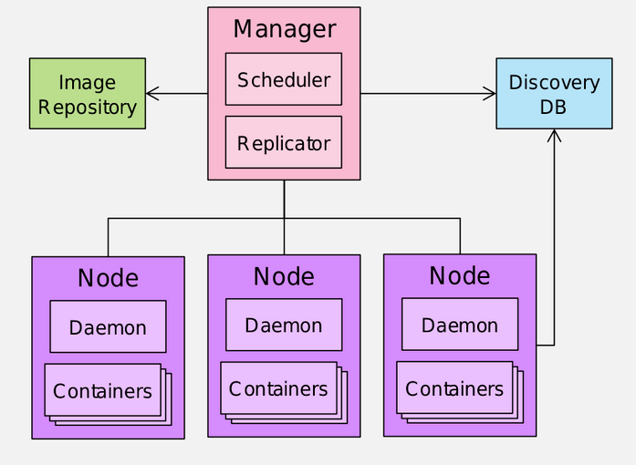

# Sadržaj

* [CWL - Scatter](#cwl---scatter)
* [Kubernetes](#kubernetes)

# CWL - Scatter

Omogućava ponavljanje koraka za različite vrednosti
ulaza.

Iz niza se uzima po jedna vrednost i onda se nad
njom izvršava dati korak. 

Da bismo iskoristili ovu funkcionalnost, potrebno je
da je navedemo kao zavisnost:
```YAML
requirements:
    ScatterFeatureRequirement: {}
```
**Napomena**: navodi se u `requirements`, a ne
u `hints`, što je slučaj sa docker-om

Pored toga, potrebno je u samom koraku navesti po čemu
će se vršiti scatter-ing, pomoću `scatter`.

Iz tog niza se uzima vrednost tako što se definiše
ulaz kome će se dodeliti niz, a zatim se u `scatter`
navede taj ulaz.

Primer (ulaz -> `message`, niz-> `message_array`):
```YAML
inputs:
  message_array: string[]

steps:
  echo:
    run: hello_world_to_stdout.cwl
    scatter: message
    in:
      message: message_array
    out: [echo_out]
```

Da je postojao još jedan korak, on bi čekao na 
završetak svih scatter-ovanih izvršenja iz koraka
`echo` (izvršenje za svaki `message`).

Kada dođe do koraka koji sledi nakon onog koji je 
scatter-ovan, taj drugi korak će predstavljati
barijeru. Na njemu će se čekati, a onda će se
nastaviti sa drugim korakom kada se sa ovim prvim
završi. Čeka se onaj koji najduže traje.  

Optimalniji način:  
Da bismo postigli paralelno, tj. nezavisno izvršenje,
potrebno je da `scatter` primenimo nad celim
workflow-om. Time će se obrada svakog `message`-a
izvršavati zasebno po koracima tog workflow-a.  

Primer:
```YAML
#!/usr/bin/env cwl-runner
cwlVersion: v1.2
class: Workflow

requirements:
 ScatterFeatureRequirement: {}
 SubworkflowFeatureRequirement: {}         # potrebno nam je za subworkflow

inputs:
  message_array: string[]

outputs: []

steps:
  subworkflow:
    in:
      message: message_array               # subworkflow-u se prosleđuje niz iz glavnog
    out: []
    scatter: message                       # scatter se koristi nad celim subworkflow-om, 
                                           # dolazi iz `in` bloka
    run:
      class: Workflow
      inputs:
        message: string
      outputs: []
      steps:
        echo:
          run: hello_world_to_stdout.cwl
          in:
            message: message               # ono po čemu se vrši scattering
          out: [echo_out]
        wc:
          run: wc-tool.cwl
          in:
            input_file: echo/echo_out
          out: []
```

## Korisni linkovi

* https://www.commonwl.org/user_guide/topics/workflows.html#scattering-steps
* https://cwl.discourse.group/t/scatter-workflow-step-n-times/71/4


# Kubernetes

Upravljanje kontejnerima koji se kreiraju sa Docker-om i 
Docker Compose-om može da bude postane otežano sa porastom
broja kontejnera kojima se upravlja.

Automatski oporavak je takođe funkcionalnost koja nam je potrebna, 
a oni je ne nude.

To se postiže orkestracijom kontejnera. Najpopularniji alat za to
je **Kubernetes** (skraćeno **k8s**). 

Pomoću njega možemo npr. da podesimo server koji bi bio na čekanju
i spreman da preuzme posao ukoliko neki drugi otkaže.

Platforma na kojoj radi k8s najčešće nije jedan računar,
već neki tip klastera.



Server se u container orchestration terminologiji 
zove **node**. Node takođe može da bude i **virtualna mašina**.

Na svakom node-u se nalazi **deamon**, neki softver koji
rukovodi kontejnerima na tom node-u.

Node-ovi su organizovani u klaster.

Njima upravlja **manager**. 

Ukoliko neki od node-ova otkaže, **replicator** će napraviti 
instance njegovih kontejnera na nekima od preostalih node-ova.

To omogućava visoku dostupnost.

Manager i replicator se oslanjaju na **image repository** koji
se nalazi lokalno kako ne bi stalno preuzimao image-e. Dođe 
nešto kao keš za image-e.

Postoji i **Discovery DB** koji čuva sve neophodne podatke, npr.
podatke koji se odnose na relociranje kontejnera, o stanju sistema, 
podatke o tome na kom portu koji servis sluša (servise discovery), ...

Ova baza se u k8s zove **etcd**.

---

k8s se nalazi u sloju iznad container engine-a (npr. docker) koji
se nalazi iznad operativnog sistema.

[A] k8s  
[B] Docker  
[C] OS  


K8s je pre koristio Docker, ali sada koristi svoju kompatabilnu 
implementaciju pa time više ne zavisi od Docker-a.

---

Komunikacija sa k8s se vrši preko **master node**-a. Njemu možemo 
pristupiti preko UI-a ili CLI-a. Oni šalju zahtev na 
API master node-a.

Pored master node-a, postoje i **worker node**-ovi. Oni su node-ovi 
koji su inicijalno spomenuti. Na njima se nalaze kontejneri.

**Kontejner** - instanca image-a (aplikacije)

**Pod** - osnovna jedinica u k8s. Obično sadrži samo 1 kontejner.
Ako ih ima više, deliće isti "IP address and port space". Može da ima 
i neki deljeni resurs između tih kontejnera, npr.  volume, ali o tome 
ćemo kasnije govoriti.

**Service** - (fiksiran) endpoint za jedan ili više pod-ova. 

Servis igra i ulogu load balancer-a. Raspoređuje zahteve po replikama
na osnovu round-robin algoritma.

To nam omogućava i horizontalno skaliranje jer možemo da dodamo nove
replike kojima bi kasnije servis dodeljivao zahteve koje trebaju da
obrade.

**Deployment** - skup podova koji se zajedno postavljaju (čine jednu
aplikaciju)

Jedan deployment se sastoji iz više ReplicaSet-ova.

**ReplicaSet** - to je neka celina koja obuhvata replike pod-ova i
njegova svrha je da osigura da će u bilo kom trenutku biti pokrenut
određeni broj replika nekog poda.

On može i da sadrži podove koji predstavljaju nadogradnju nekog
poda. Omogućava da se vratimo na prethodnu verziju ukoliko je to 
potrebno ili da koristimo trenutnu verziju dok razvijamo i koristimo 
novu verziju (mogu istovremeno obe verzije da se koriste). 

Rolling update (korisan za A/B testing)

---

k8s nudi i elastičnost pomoću HPA - Horizontal Pod Autoscaling.

HPA predstavlja automatsko skaliranje ukoliko su neki definisani uslovi
ispunjeni. Na primer, možemo da definišemo da treba doći do skaliranja
(kreiranja novih pod-ova) ukoliko iskorišćenost CPU-a pređe 50%.

Kod: 
```Shell
kubectl autoscale deployment <dpl-name> --cpu-percentage=50 --min=1 --max=10 deployment "<hpa-name>" autoscaled
```

Ovime se definiše da će u tom slučaju biti potrebno da se kreira minimalno 1 pod, a
maksimalno 10 podova.

Vertikalno skaliranje: uvećavanje resursa node-a (CPU, RAM, ...)

---

Pri korišćenju k8s, treba voditi računa o tome u kom namespace-u se izvršavaju
komande. Izbor namespace-a u kome ćemo vršiti komande vršimo sa: `kubectl -n ime ...`

Prikaz svih podova (u default-nom ns):
```Shell
kubectl get pods
```
Prikaz svih resursa u ns:
```Shell
kubectl get all
```

Kreiranje deployment-a:
```Shell
kubectl create deployment microbot --image=dontrebootme/microbot:v1
```

Ovime će biti kreiran i neki pod. Kontejneru iz pod-a koji je kreiran na
ovaj način se ne može pristupiti jer se nalaze na izolovanoj mreži. 
Vidljivi su samo podovima i servisima unutar istog klastera, ali ne i van
njega.

Da bismo im pristupili sa nekog mesta izvan klastera, potrebno je da
uradimo port-forwarding, tj. ono mapiranje portova koje smo radili 
ručno u docker compose-u.

To radimo pomoću servisa:
```Shell
kubectl expose deployment microbot --type=NodePort --port=80 --name=microbot-service
```

`microbot` je ime deployment-a.

Informaciju o tome gde je servis eksponiran možemo videti u ispisu komande:
```Shell
kubectl get services
```

u koloni `CLUSTER-ID` i `PORT(S)`. Port se nasumično dodeljuje, najčešće je to
neki broj nakon 32 000.

---

Pored automatskog skaliranja, možemo izvršiti i manuelno:
```Shell
kubectl scale deployment microbot --replicas=3
```

Sada imamo više replika pa se servis neće pružati samo sa jedne replike, već
će sistemom round-robina smenjivati te replike, odnosno redom će im 
prosleđivati zahteve.

## Korisni linkovi

